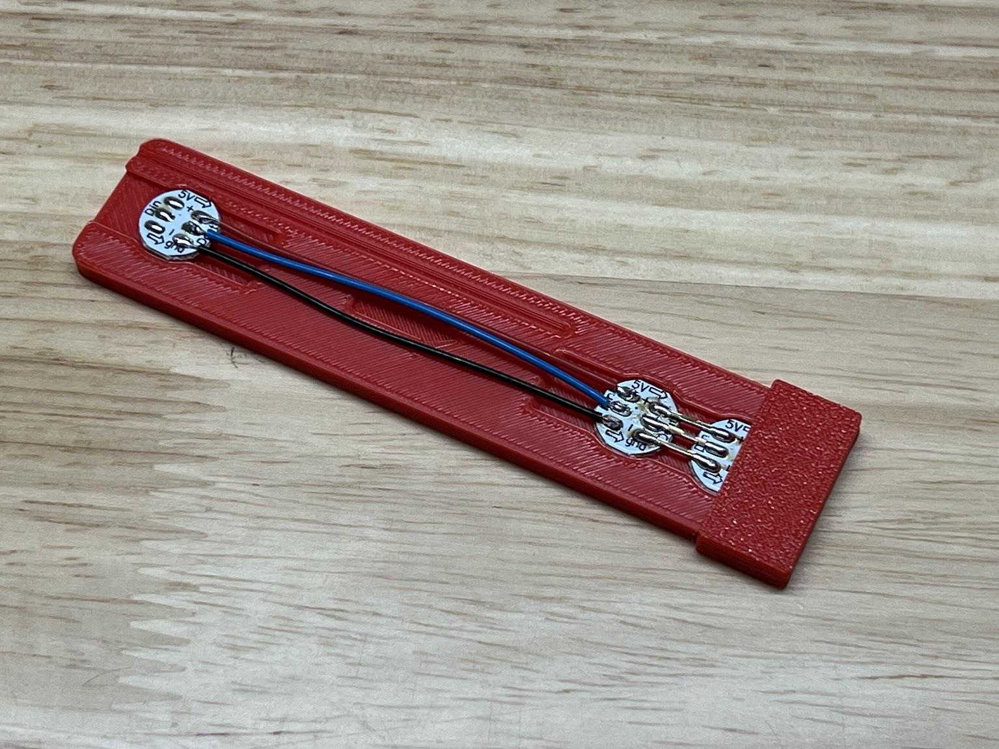
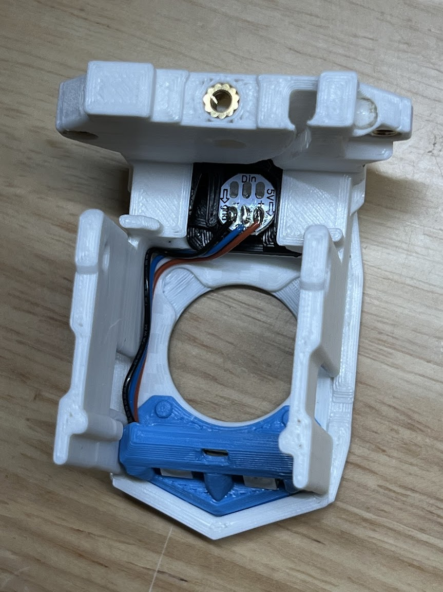

# AntHead LED Solder Fixture

 

## What is this?

This is used to hold the LEDs for soldering when using the Nozzle LEDs and the Body LED in the AntHead.  It also provides a wire length measurement in the groove.  

## How to use

- Use the groove to cut the wires to length
- Insert the LEDs 
- Solder the 2 nozzle LEDs first.  I recommend using some rigid pins or solid wire. Small tweezers help. 