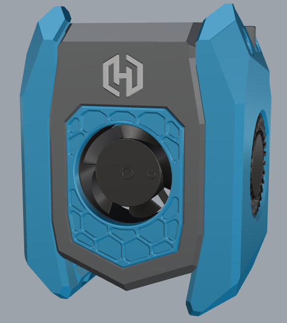

# MainBody with HexZero logo included led option

This mod is made for the HexZero.  
[Github link HexZero](https://github.com/Alexander-T-Moss/Hex-Zero) 

## Which 3d parts are shared
Only the modded parts can be find in this mod.  
This includes the parts for the led.  
Non modded parts, that are the default AntHead parts and can be find in de main repository of the AntHead.  
The parts are made on AntHead version43

## Be carefull
Be carefull when you assemble the led.
Because of the design of the HexZero logo and the space that is availble, the parts are thin.
Take this in care, when you assemble the mainbody.

## Hardware needed for this mode
### For the AntHead
Nothing extra is needed for the AntHead, when looking at the hardware.  
