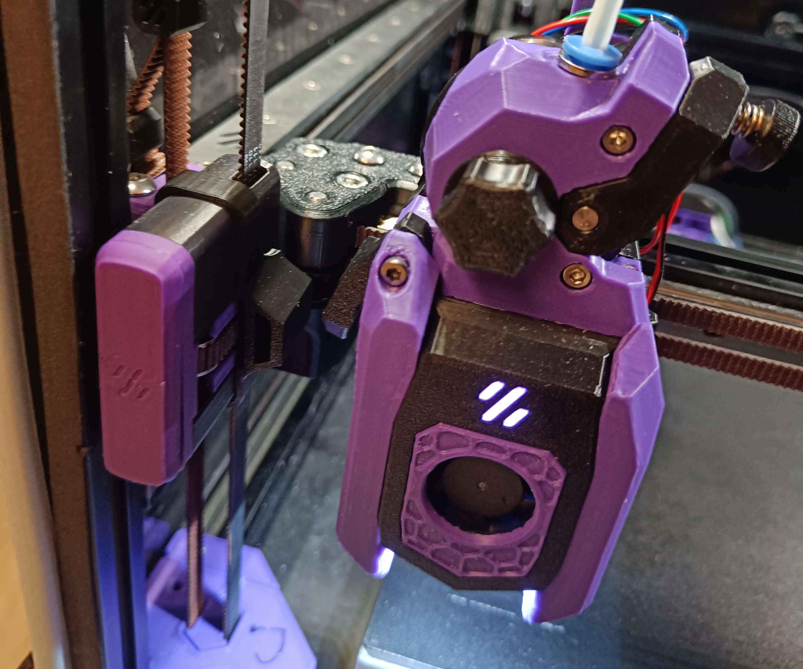

# SBFI Actuator

This is a clip-on depressor/actuator to drive the leafcutter arm into, made to fit [Smooth Beefy Front Idlers](https://www.printables.com/model/890840-sbfi-smooth-beefy-front-idlers)

You will lose only approximately 4mm x 4mm of travel area, less if you place the clip more forward.

Likely compatible with standard BFI, but untested.
