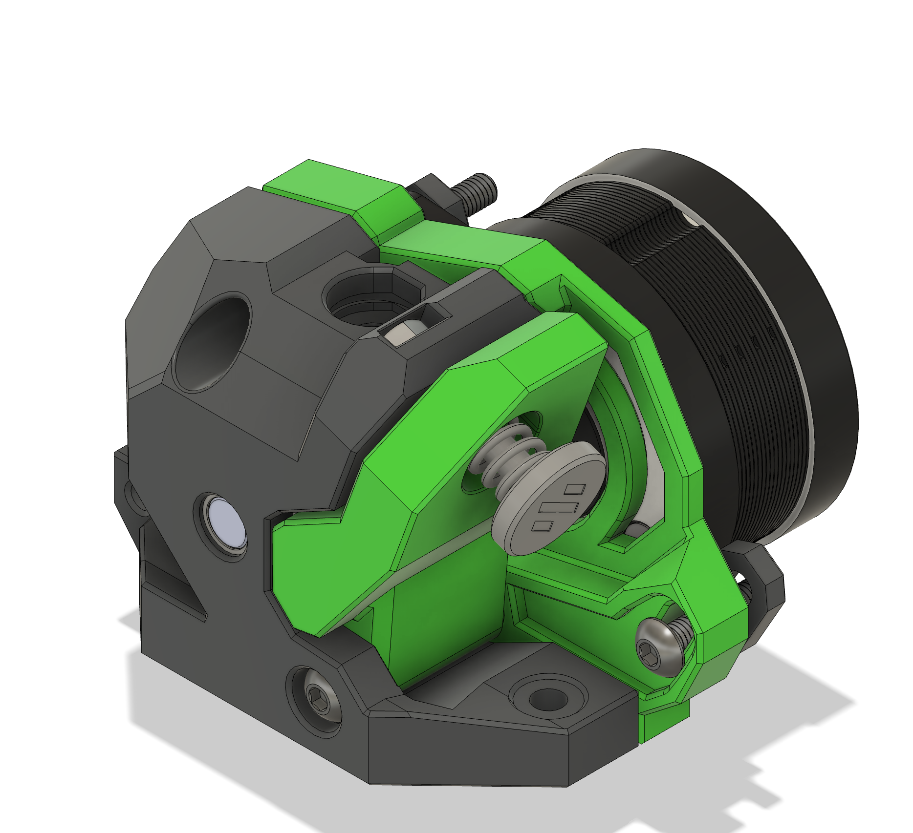
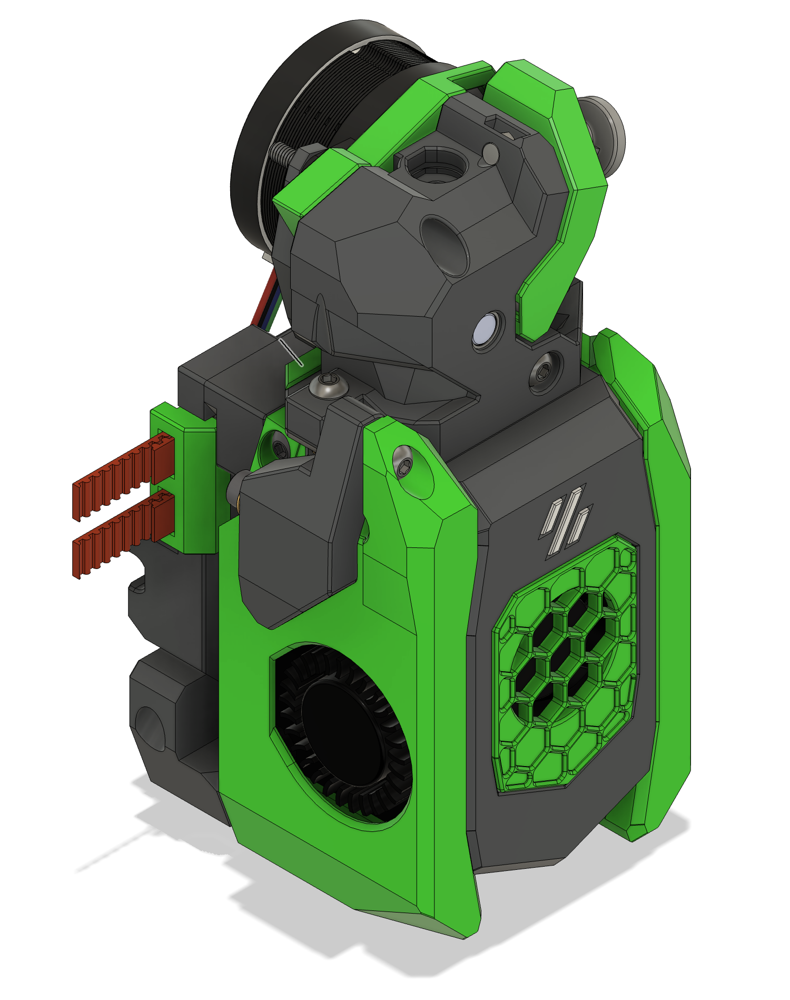

[![CC BY-NC-SA 4.0][cc-by-nc-sa-shield]][cc-by-nc-sa]

# CURRENTLY IN BETA - USE AT YOUR OWN RISK

# AntHead WW-BMG: Wristwatch using Bondtech RIGDA with dual filament sensors for the AntHead toolhead
Originally designed by [ByThorsThunder](https://github.com/bythorsthunder) and adapted for the [A4T toolhead](https://github.com/Armchair-Heavy-Industries/A4T) by [DW-Tas](https://github.com/DW-Tas). Adapted from that adaptation for the [AntHead](https://github.com/PrintersForAnts/AntHead) toolhead (v72).

### Discord links
For discussions around AntHead checkout the PrintersForAnts section at the DoomCube discord.  
 
For discussions around the A4T toolhead checkout Armchair Heavy at their discord.  

 

  
I had BMG gears lying around and wanted to use that for an AntHead build to use with BoxTurtle. The A4T adaptation already had the dual sensors and just needed some tweaking to make it work with AntHead and LeafCutter.   

## Bill of Materials (BOM)
***`*Not including carriage hardware`***
| Qty | Item                                          | Notes                        |
| --- | --------------------------------------------- | ----------------------------------------------------------------------------------------- |
| 2   | M3 Nut                       | Using normal nuts because you probably have them. Tolerances should be tight enough to prevent spin.                        |
| 1   | M3 x 20 BHCS                                   | Top Motor screw.  At least M3x18 BHCS                  |
| 3   | M3 x 14 BHCS                 | Bottom Motor mount.  You'll need M3x14 for mounting to the AntHead and for the LeafCutter lever arm | 
| 1   | M3 x 12 BHCS                                  | Second mounting screw for the AntHead            |
| 1   | M3 x 30 BHCS				| Mount Tension arm to body                 |
| 1   | ECAS       | |
| 1   | RIDGA / BMG hardware set                               | If standard BMG configure for RIDGA |
| 2   | 20mm long 3mm internally threaded stand off  | To attach toolhead board to the back of the extruder motor                    |

## Printing parts
### Print settings
Parts are meant to be printed in 0.2mm layer heights, 0.25mm first layer should be OK. Anything else will likely cause the built-in supports to fail or fuse to the printed part. 
Print testing is still TBD 

Voron settings are a good starting point for 0.4mm wall widths (four walls, 5 top/bottom layers and 40% infill). 

### Credits
* Huge thanks to DW-Tas for the bulk of the modifications to the Wristwatch for dual sensors
* Also big thanks to ByThorsThunder for the original design

This work is licensed under a
[Creative Commons Attribution-NonCommercial-ShareAlike 4.0 International License][cc-by-nc-sa].

[![CC BY-NC-SA 4.0][cc-by-nc-sa-image]][cc-by-nc-sa]

[cc-by-nc-sa]: http://creativecommons.org/licenses/by-nc-sa/4.0/
[cc-by-nc-sa-image]: https://licensebuttons.net/l/by-nc-sa/4.0/88x31.png
[cc-by-nc-sa-shield]: https://img.shields.io/badge/License-CC%20BY--NC--SA%204.0-lightgrey.svg