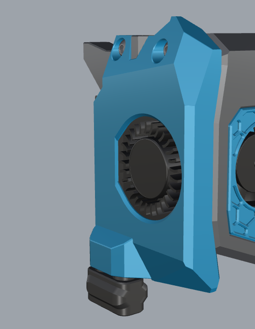
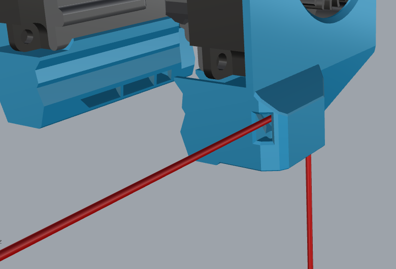
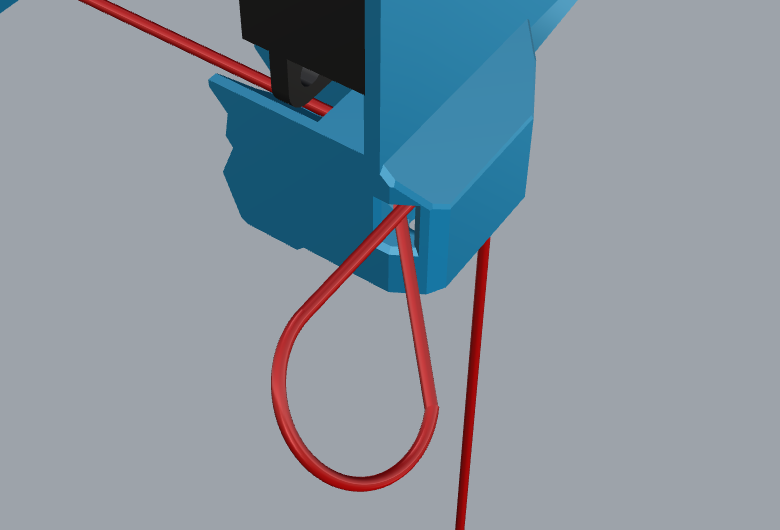
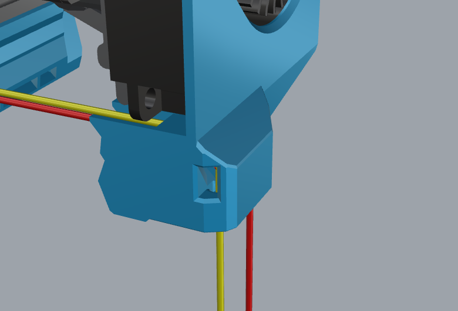

# ZeroClick on left ducting

## Idea about this mod
This mod is started for the HexZero.  
The HexZero has the dual extrusions in the back, like the Voron V0.2.  
On the HexZero the change is made, that the gantry can move over these dual extrusions.  
There is that little space, that there can't be parts on the back of the toolhead, because these would collide with these Z-extrusions.  
This mod moves the probe to the side, to give free space on the back, to prevent this collision.  
[Github link HexZero](https://github.com/Alexander-T-Moss/Hex-Zero) 

## Which 3d parts are shared
Only the modded parts can be find in this mod.  
Non modded parts, that are the default AntHead parts and can be find in de main repository of the AntHead.  
Only the standard fan is modded. Other fan ductings are not changed, but could be done by de delivered CAD.

## Hardware needed for this mode
### For the AntHead
Nothing extra is needed for the AntHead, when looking at the hardware.  
### For the ZeroClick
The default parts for the ZeroClick are needed.  
Extra parts could be the parts for the dock, depends on the user choice, what to use.  
For the ZeroClick follow there github.  
[Github link ZeroClick](https://github.com/zruncho3d/ZeroClick) 

## How to wire the ducting
Before following the ZeroClick manual, the explanation how the wiring has to be done
### Step 1
Start by placing wire in the wire-guide of the front magnet-hole and let it stick out of the back.   

### Step 2
Loop back the wire and place it back in the hole it comes out, but now in the wire-guide that goes underneat the fan.   
Carefully pull on the wire end and help them, that the loop disappears inside the ducting, and nothing is sticking out the back.  
Not easy to draw in Rhino, to make a wire loop, but you will get it what i mean :blush:  

### Step 3
Place the wire-guide of the back magnet-hole.   
This wire-guide hole is almost in line with the wire-guide underneat the fan, that you can route it in a single job.  

### Step 4
Now that the ZeroClick wires are near the fan, follow the wire route of the fan.
How to finish the wiring for the ZeroClick magnets, see the ZeroClick manual on there github
